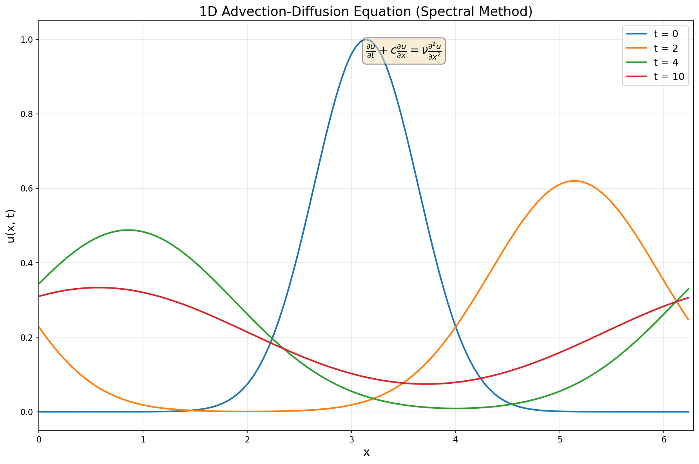
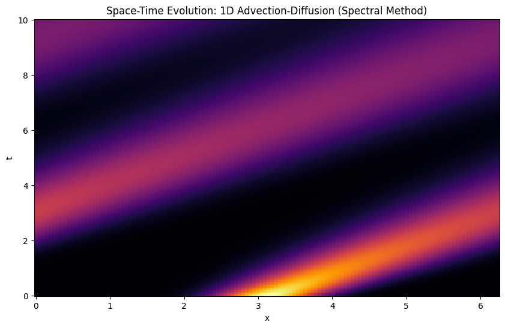

# FFT — Implementation and Applications

Three separate explorations of the Fast Fourier Transform, going from building it from scratch to using it for solving PDEs and image processing. Each has a Jupyter notebook (with outputs) and a plain `.py` version.

---

## What's in here

### 1. FFT & IFFT from Scratch (`FFT_IFFT`)
A recursive implementation of the Cooley-Tukey FFT algorithm written without using any built-in FFT libraries. Also implements IFFT and verifies reconstruction two ways — using the inverse transform and using direct basis vector multiplication. Both give the same result.

### 2. Advection-Diffusion (Spectral Method) (`advection_diffusion_spectral`)
Solves the 1D advection-diffusion equation spectrally by transforming to frequency space, applying the exact solution operator per timestep, and transforming back. Much cleaner than finite difference for periodic domains.




### 3. Image Fourier Transform (`image_FT`)
Applies 2D FFT to a grayscale image, filters out high-frequency components by zeroing out coefficients beyond a cutoff (kx, ky), and reconstructs the image. Shows how much of the image information lives in the low frequencies.

---

## How to Run

> All scripts use local file paths that you'll need to update before running.

**FFT & IFFT:**
```bash
python FFT_IFFT.py
```
No external files needed, runs on a test signal defined in the script.

**Advection-Diffusion:**
```bash
python advection_diffusion_spectral.py
```
Generates both plots — line plot at different times and the space-time heatmap.

**Image FT:**
```bash
python image_FT.py
```
Needs a grayscale image. Update this line in the script to point to your image:
```python
img = cv2.imread("your_image.png", cv2.IMREAD_GRAYSCALE)
```
You can change `k_x` and `k_y` to control how many frequency components are kept.

For notebooks, just open them in Jupyter — outputs are already there.

---

## Parameters

**Advection-Diffusion (`advection_diffusion_spectral.py`):**

| Parameter | Default | Description |
|-----------|---------|-------------|
| `N` | 128 | Number of grid points |
| `c` | 1.0 | Advection speed |
| `nu` | 0.1 | Diffusion coefficient |
| `dt` | 0.01 | Time step |

**Image FT (`image_FT.py`):**

| Parameter | Default | Description |
|-----------|---------|-------------|
| `k_x` | 50 | Frequency cutoff in x direction |
| `k_y` | 50 | Frequency cutoff in y direction |

---

## Tech Stack

- **Python** — `numpy`, `matplotlib`, `scipy`, `opencv`
- **Jupyter** — notebooks with inline outputs for each script

---

## Physics / Math Background

The FFT is an O(N log N) algorithm for computing the Discrete Fourier Transform, which decomposes a signal into its frequency components. The Cooley-Tukey algorithm does this recursively by splitting the input into even and odd indexed elements.

For the advection-diffusion equation — ∂u/∂t + c ∂u/∂x = ν ∂²u/∂x² — the spectral method works by taking the FFT of u, evolving each Fourier mode exactly using the analytical solution operator exp(−i c k dt − ν k² dt), then transforming back. This avoids the numerical diffusion you get with finite difference schemes and is spectrally accurate for smooth, periodic solutions.

The image filtering part shows the same idea in 2D — most of the visual information in an image is carried by low frequency modes, so you can throw away a large portion of the coefficients and still get a recognizable reconstruction.
